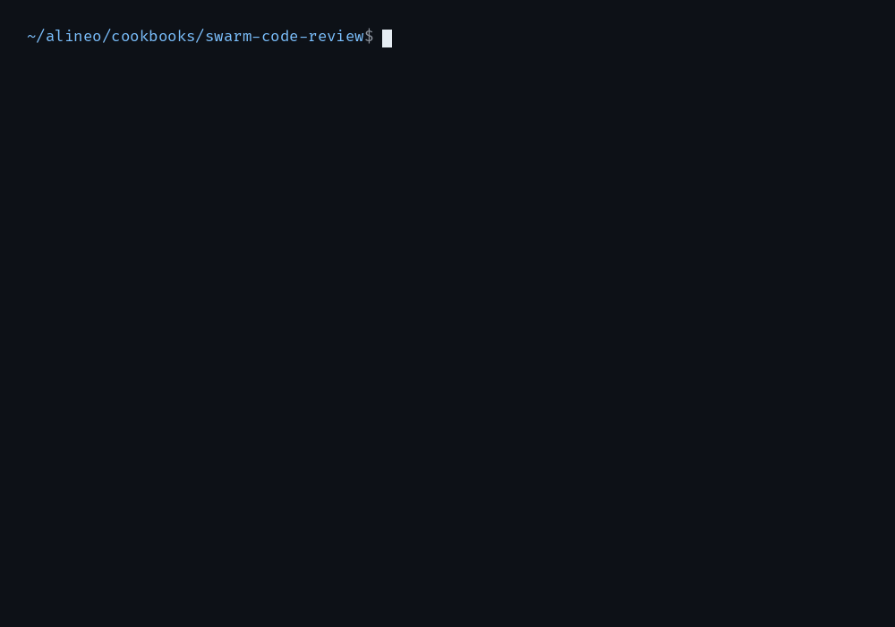

<div align="center">

<picture>
  <source media="(prefers-color-scheme: dark)" srcset=".github/assets/wordmark-dark.png">
  
</picture>

**A control plane for swarms of sandboxed agents.**

[Docs](https://docs.alineo.tech/docs/agent) ·
[Quickstart](https://docs.alineo.tech/docs/agent/getting-started/quickstart) ·
[Cookbooks](https://docs.alineo.tech/docs/cookbooks) ·
[Discord](https://discord.com/invite/XGkPu3YBH4)

[](https://www.npmjs.com/package/alineo)
[](https://github.com/DrejT/alineo/actions/workflows/ci.yml)
[](LICENSE)

</div>



<sub>A swarm code review driven through alineod: one checkout, three forked reviewers, one merged
report. Sped-up replay of a real run of the
[swarm-code-review cookbook](https://docs.alineo.tech/docs/cookbooks/swarm-code-review).</sub>

## Quickstart

```bash
bunx alineo-cli init                # starts OpenSandbox in Docker
bun add alineo @alineo-labs/sqlite
export NVIDIA_API_KEY=nvapi-...     # free key from build.nvidia.com
```

```ts
import { Alineo, textOnly, type AgentSpec } from "alineo";
import { SQLiteAdapter } from "@alineo-labs/sqlite";

const spec: AgentSpec = {
  name: "hello-agent",
  harness: "pi",
  provider: "nvidia",
  model: "nvidia/nemotron-3.5-lightning-30b-a3b",
  packages: ["python3"],
  env: { NVIDIA_API_KEY: "${NVIDIA_API_KEY}" }, // resolved from your shell
  resources: { cpu: "1000m", memory: "2Gi" },
};

const adapter = new SQLiteAdapter("./.alineo/ledger.db");
const agent = await Alineo.start(spec, { adapter });
try {
  for await (const chunk of textOnly(agent.prompt("Write and run a Python hello world script."))) {
    process.stdout.write(chunk);
  }
} finally {
  await agent.close();
}
```

Agents run [Pi](https://pi.ai) inside [OpenSandbox](https://opensandbox.ai) containers.
[Full quickstart →](https://docs.alineo.tech/docs/agent/getting-started/quickstart)

## What you get

- **[Fork a live sandbox](https://docs.alineo.tech/docs/alineod/guides/fan-out-gather)** — spawn a
  child agent from a running one, with the checkout and installed packages already on disk.
- **[Steer, pause, resume](https://docs.alineo.tech/docs/alineod/guides/steering-and-pausing)** —
  redirect or freeze an agent mid-turn, no restart.
- **[Survive a crash](https://docs.alineo.tech/docs/alineod)** — alineod replays its ledger and
  reattaches to in-flight turns, so the daemon can die without losing the swarm.
- **[Gate what agents can do](https://docs.alineo.tech/docs/agent/getting-started/permissions)** —
  hold risky tool calls and network egress for human approval.
- **[Audit everything](https://docs.alineo.tech/docs/core)** — every exec and tool call lands in a
  durable SQLite or Postgres ledger.

<details>
<summary><b>Packages</b></summary>

| Package                                               | Description                                                   |
| ----------------------------------------------------- | ------------------------------------------------------------- |
| [`alineo`](packages/agent)                            | Run Pi coding agents in sandbox containers                    |
| [`alineo-cli`](packages/cli)                          | Local setup, spec management, agent session lifecycle         |
| [`@alineo-labs/sandbox`](packages/sdks/typescript)    | Sandbox client — `Sandbox`, `SandboxHandle`, `ExecHandle`     |
| [`@alineo-labs/workflow`](packages/workflow)          | Lazy pipeline builder — retry, branching, fan-out, parallel   |
| [`@alineo-labs/sqlite`](packages/adapters/sqlite)     | SQLite storage adapter (local dev, zero infra)                |
| [`@alineo-labs/postgres`](packages/adapters/postgres) | Postgres storage adapter (production)                         |
| [`@alineo-labs/otel`](packages/adapters/otel)         | OpenTelemetry hooks adapter                                   |
| [`@alineo-labs/flue`](packages/adapters/flue)         | Flue runtime adapter — run Flue workflows against a sandbox   |

</details>

<details>
<summary><b>Agent Skills</b></summary>

alineo ships a `SKILL.md` at `.agents/skills/alineo/` — a curated SDK/CLI reference that AI coding
agents can load directly, installable with the [Skills CLI](https://skills.sh):

```bash
npx skills add DrejT/alineo --skill alineo
```

</details>

## Community

[Discord](https://discord.com/invite/XGkPu3YBH4) ·
[Issues](https://github.com/DrejT/alineo/issues) ·
[Contributing](CONTRIBUTING.md) · Apache 2.0
