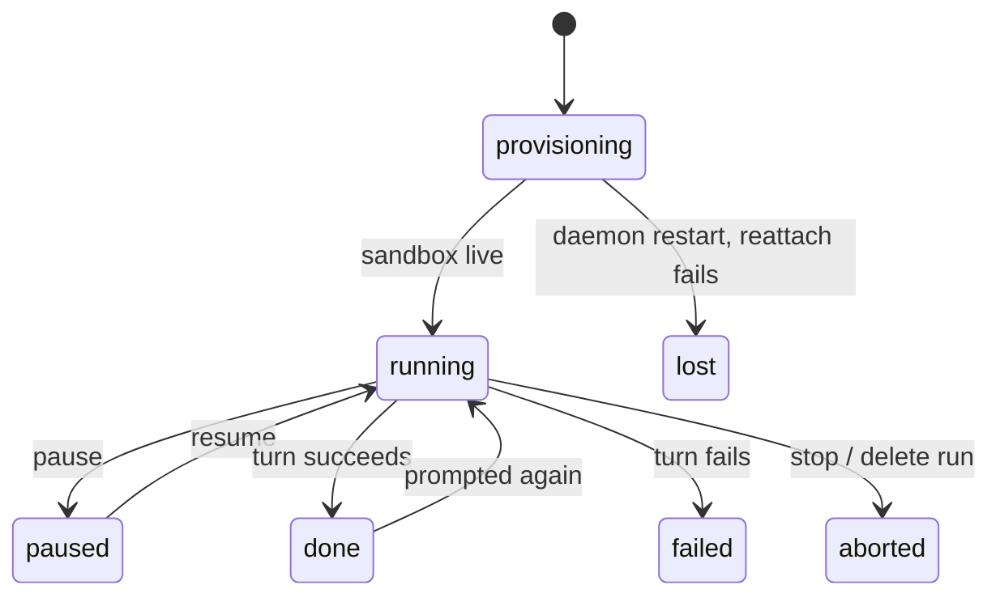

The SDK makes one agent easy: load it, prompt it, fork a child from its sandbox. A **swarm** —
a lead forking three workers, one of them paused mid-turn, an editor waiting on all three
before it starts — is a different problem. Something has to track the tree, hold the gather
step until its dependencies settle, and put every agent back together if the process running
it dies halfway through. Building that yourself means writing a control plane before you've
written the task.

alineod is that control plane, run once, driven over HTTP.

## What it does

A gather is a spawn with a `waitFor` list — alineod holds it until every listed agent settles,
then forks it from its parent and writes each dependency's result into its sandbox:

```http
POST /runs/r_3f9a1c20/agents
content-type: application/json

{
  "parentAgentId": "a_7b2e44d1",
  "waitFor": ["a_c01d9e3a", "a_5e8f2b71", "a_91aa0c4d"],
  "spec": { "name": "editor", "cli": "pi" },
  "prompt": "Read /inputs.json and merge the three reports into one."
}
```

The request returns `202` immediately. `alineod` moves the child to `spawning`, waits for the
three dependencies to reach a settled outcome, forks the editor from its parent's sandbox, and
drops each dependency's result at `/inputs/<agentId>.txt` plus an `/inputs.json` manifest
before the prompt ever runs.

## The demo

The [`swarm-code-review`](https://github.com/DrejT/alineo/tree/main/cookbooks/swarm-code-review)
cookbook runs this for real: one lead clones a repository, forks three reviewers — security,
correctness, tests — pauses and resumes one mid-review, steers another onto a narrower brief,
then gathers all three into one report through an editor.


## How it works

Every agent is a live OpenSandbox container, not a child process of the daemon — so alineod
itself can crash and restart without losing the swarm. On boot it replays its append-only
ledger, then reconnects to every still-live agent with
[`Alineo.reattach()`](/docs/agent/api-reference/agent#alineoreattach), which rebinds to the
harness bridge already running in the container instead of restarting it. An in-flight turn
survives the daemon going away.



If `reattach()` doesn't get an answer — the bridge itself is gone, not just the daemon that
was watching it — alineod falls back to `Alineo.resume()`, which restarts the bridge and does
drop the in-flight turn. Only if that fails too does a live agent end as `lost`; a finished
agent just keeps the outcome it already recorded.

## What it doesn't do

Results are inline text, not file references: a settled handle stores the agent's final
message, addressed as `fs://<agentId>/result.md`. Resolving an arbitrary path inside an
agent's sandbox as a result is planned, not shipped. alineod is also one process — it's a
control plane for one swarm on one host, not a distributed scheduler across machines. And it's
software you run, not a hosted service: `alineo init` starts it in Docker alongside
OpenSandbox, but you own the container.

## Try it

- [alineod docs](/docs/alineod) — routes, events, budgets, and crash recovery in full.
- [`cookbooks/swarm-code-review`](https://github.com/DrejT/alineo/tree/main/cookbooks/swarm-code-review)
  — the run behind the demo above, runnable end to end.
