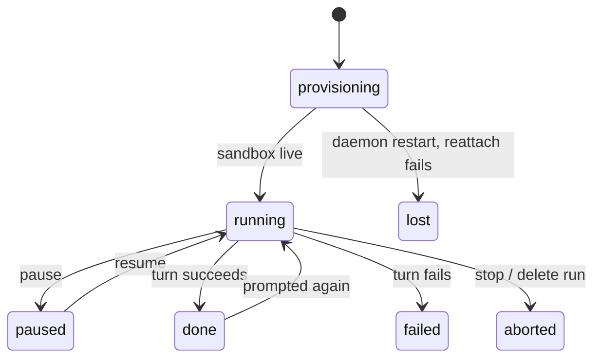

The SDK makes one agent easy: load it, prompt it, fork a child from its sandbox. A **swarm** —
a lead forking three workers, one of them paused mid-turn, an editor waiting on all three
before it starts — is a different problem. Something has to track the tree, hold the gather
step until its dependencies settle, and put every agent back together if the process running
it dies halfway through. Building that yourself means writing a control plane before you've
written the task.

[alineod](/docs/alineod) is that control plane, run once, driven over HTTP.

## What it does

A gather is a spawn with a `waitFor` list — alineod holds it until every listed agent settles,
then forks it from its parent and writes each dependency's result into its sandbox:

```http
POST /runs/r_3f9a1c20/agents
content-type: application/json

{
  "parentAgentId": "a_7b2e44d1",
  "waitFor": ["a_c01d9e3a", "a_5e8f2b71", "a_91aa0c4d"],
  "spec": { "name": "editor", "cli": "pi" },
  "prompt": "Read /inputs.json and merge the three reports into one."
}
```

The request returns `202` immediately. `alineod` moves the child to `spawning`, waits for the
three dependencies to reach a settled outcome, forks the editor from its parent's sandbox, and
drops each dependency's result at `/inputs/<agentId>.txt` plus an `/inputs.json` manifest
before the prompt ever runs.

## The routes

That gather is one of thirteen routes. There's no SDK client for alineod on purpose — the
interface is the wire protocol, generated from the same Zod schemas as
`specs/alineod/openapi.json` and the event schema, so this table can't drift from what the
daemon actually accepts:

| Method   | Path                      | What it does                               |
| -------- | ------------------------- | ------------------------------------------ |
| `GET`    | `/health`                 | Liveness check.                            |
| `POST`   | `/runs`                   | Create a run and its root agent.           |
| `GET`    | `/runs/:runId`            | The run's spawn tree.                      |
| `DELETE` | `/runs/:runId`            | Stop every live agent in the run.          |
| `GET`    | `/runs/:runId/events`     | The run's event stream (SSE).              |
| `POST`   | `/runs/:runId/agents`     | Spawn a child agent.                       |
| `GET`    | `/agents/:agentId`        | One agent's state and session stats.       |
| `POST`   | `/agents/:agentId/prompt` | Start a new turn.                          |
| `POST`   | `/agents/:agentId/steer`  | Redirect the current turn.                 |
| `POST`   | `/agents/:agentId/pause`  | Freeze the agent's container.              |
| `POST`   | `/agents/:agentId/resume` | Thaw a paused container.                   |
| `POST`   | `/agents/:agentId/stop`   | Abort and close the agent.                 |
| `GET`    | `/agents/:agentId/result` | Get, or long-poll for, the agent's result. |

Every verb here is scoped to exactly one agent — there's no "steer every worker" or "pause this
whole subtree" yet. More on that below.

## The demo

The [`swarm-code-review`](https://github.com/DrejT/alineo/tree/main/cookbooks/swarm-code-review)
cookbook runs this for real: one lead clones a repository, forks three reviewers — security,
correctness, tests — pauses and resumes one mid-review, steers another onto a narrower brief,
then gathers all three into one report through an editor.


## How it works

Every agent is a live OpenSandbox container, not a child process of the daemon — so alineod
itself can crash and restart without losing the swarm. On boot it replays its append-only
ledger, then reconnects to every still-live agent with
[`Alineo.reattach()`](/docs/agent/api-reference/alineo#alineoreattach), which rebinds to the
harness bridge already running in the container instead of restarting it. An in-flight turn
survives the daemon going away.



If `reattach()` doesn't get an answer — the bridge itself is gone, not just the daemon that
was watching it — alineod falls back to `Alineo.resume()`, which restarts the bridge and does
drop the in-flight turn. Only if that fails too does a live agent end as `lost`; a finished
agent just keeps the outcome it already recorded.

## How it fits

Every agent alineod runs — lead or child — is spawned from the exact same `AgentSpec` the SDK
uses for a single agent, written to a spec file and handed to the SDK's own `spawn()`. The
format doesn't change shape to become swarm-friendly. That means anything you've already set up
per-agent keeps working without a second configuration: an
[`AgentSpec.permissions`](/docs/agent/concepts/permissions) gate pausing a risky tool
call for a human still gates that call inside a forked worker three levels deep; a
[credential bound with `approval: "hold"`](/docs/agent/concepts/permissions#holding-network-egress-for-approval) still holds the
first request to that host until someone approves it, no matter where in the tree the agent
sits. You don't secure "an agent" once and "a swarm" separately — it's the same spec either way.

The daemon installs the same way, too: `alineo init` starts it in Docker right alongside
OpenSandbox, using whichever of your provider API keys are already in the shell. No new
account, no new config format — just a new way to run agents you already know how to spec.

## What it doesn't do

Results are inline text, not file references — a settled handle stores the agent's final
message, addressed as `fs://<agentId>/result.md`, not an arbitrary path inside the sandbox.
alineod is also one process: a control plane for one swarm on one host, not a distributed
scheduler across machines. And it's software you run, not a hosted service — `alineo init`
starts it in Docker alongside OpenSandbox, but you own the container.

## Where this is going

Today, every control action reaches one agent at a time — steering, pausing, or stopping a
five-agent review means up to five requests. That's fine at five; it won't be at twenty. The
next round of work makes the swarm itself the unit of control: redirect or pause a whole branch
of workers in one call, and undo a bad fan-out with a rollback instead of only being able to
abort it.

Gather grows past "wait for everyone" the same way. `waitFor` today blocks until every listed
dependency settles, which is the wrong shape the moment one worker is a straggler you don't want
holding up the rest. The plan is to let a gather proceed once enough of its dependencies are in,
or react the moment any one of them finishes, instead of always waiting on all of them.

And as swarms stop being single-player — a person driving one from a terminal, an agent forking
its own children, another service polling the same run — alineod needs a real answer to "who's
allowed to do what to a tree they didn't start." That's the least-finished part of the daemon
today, and where the design work is headed next.

None of this changes the shape you already know: it's the same routes, the same `AgentSpec`,
just more of the swarm addressable at once.

## Try it

- [alineod docs](/docs/alineod) — routes, events, budgets, and crash recovery in full.
- [`cookbooks/swarm-code-review`](https://github.com/DrejT/alineo/tree/main/cookbooks/swarm-code-review)
  — the run behind the demo above, runnable end to end.
