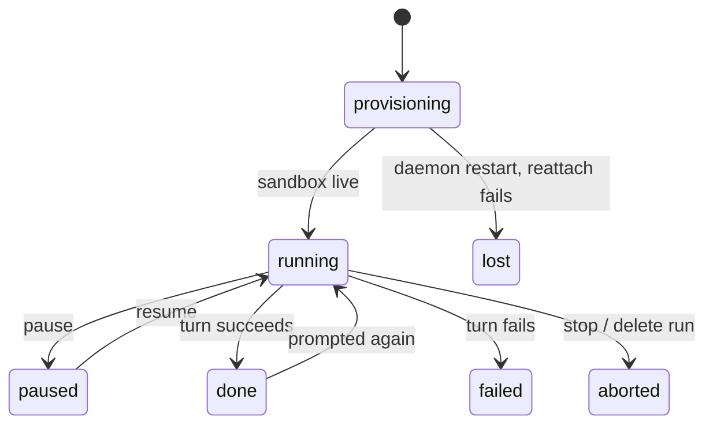

The SDK makes one agent easy: load it, prompt it, fork a child from its sandbox. A **swarm** —
a lead forking three workers, one of them paused mid-turn, an editor waiting on all three
before it starts — is a different problem. Something has to track the tree, hold the gather
step until its dependencies settle, and put every agent back together if the process running
it dies halfway through. Building that yourself means writing a control plane before you've
written the task.

[alineod](/docs/alineod) is that control plane, run once, driven over HTTP.

## What it does

A gather is a spawn with a `waitFor` list — alineod holds it until every listed agent settles,
then forks it from its parent and writes each dependency's result into its sandbox:

```http
POST /runs/r_3f9a1c20/agents
content-type: application/json

{
  "parentAgentId": "a_7b2e44d1",
  "waitFor": ["a_c01d9e3a", "a_5e8f2b71", "a_91aa0c4d"],
  "spec": { "name": "editor", "cli": "pi" },
  "prompt": "Read /inputs.json and merge the three reports into one."
}
```

The request returns `202` immediately. `alineod` moves the child to `spawning`, waits for the
three dependencies to reach a settled outcome, forks the editor from its parent's sandbox, and
drops each dependency's result at `/inputs/<agentId>.txt` plus an `/inputs.json` manifest
before the prompt ever runs.

## The routes

That gather is one of thirteen routes. There's no SDK client for alineod on purpose — the
interface is the wire protocol, generated from the same Zod schemas as
`specs/alineod/openapi.json` and the event schema, so this table can't drift from what the
daemon actually accepts:

| Method   | Path                      | What it does                               |
| -------- | ------------------------- | ------------------------------------------ |
| `GET`    | `/health`                 | Liveness check.                            |
| `POST`   | `/runs`                   | Create a run and its root agent.           |
| `GET`    | `/runs/:runId`            | The run's spawn tree.                      |
| `DELETE` | `/runs/:runId`            | Stop every live agent in the run.          |
| `GET`    | `/runs/:runId/events`     | The run's event stream (SSE).              |
| `POST`   | `/runs/:runId/agents`     | Spawn a child agent.                       |
| `GET`    | `/agents/:agentId`        | One agent's state and session stats.       |
| `POST`   | `/agents/:agentId/prompt` | Start a new turn.                          |
| `POST`   | `/agents/:agentId/steer`  | Redirect the current turn.                 |
| `POST`   | `/agents/:agentId/pause`  | Freeze the agent's container.              |
| `POST`   | `/agents/:agentId/resume` | Thaw a paused container.                   |
| `POST`   | `/agents/:agentId/stop`   | Abort and close the agent.                 |
| `GET`    | `/agents/:agentId/result` | Get, or long-poll for, the agent's result. |

Every verb here is scoped to exactly one agent — there's no "steer every worker" or "pause this
whole subtree" yet. More on that below.

## The demo

The [`swarm-code-review`](https://github.com/DrejT/alineo/tree/main/cookbooks/swarm-code-review)
cookbook runs this for real: one lead clones a repository, forks three reviewers — security,
correctness, tests — pauses and resumes one mid-review, steers another onto a narrower brief,
then gathers all three into one report through an editor.


## How it works

Every agent is a live OpenSandbox container, not a child process of the daemon — so alineod
itself can crash and restart without losing the swarm. On boot it replays its append-only
ledger, then reconnects to every still-live agent with
[`Alineo.reattach()`](/docs/agent/api-reference/agent#alineoreattach), which rebinds to the
harness bridge already running in the container instead of restarting it. An in-flight turn
survives the daemon going away.



If `reattach()` doesn't get an answer — the bridge itself is gone, not just the daemon that
was watching it — alineod falls back to `Alineo.resume()`, which restarts the bridge and does
drop the in-flight turn. Only if that fails too does a live agent end as `lost`; a finished
agent just keeps the outcome it already recorded.

## What it doesn't do

Results are inline text, not file references — a settled handle stores the agent's final
message, addressed as `fs://<agentId>/result.md`, not an arbitrary path inside the sandbox.
alineod is also one process: a control plane for one swarm on one host, not a distributed
scheduler across machines. And it's software you run, not a hosted service — `alineo init`
starts it in Docker alongside OpenSandbox, but you own the container.

## Where this is going

Every control verb in the table above takes exactly one `agentId`. That's a sequencing choice,
not the ceiling — the primitives that make a swarm crash-safe had to exist before it was worth
making them expressive. Three things are next, roughly in this order.

**Subtree-scoped control.** `steer(subtree(x))` and a batch `stop` are the obvious next verbs —
today, redirecting five workers at once means five requests. A shallow checkpoint/rollback on a
parent is the other half of the same idea: undo a bad fan-out instead of only being able to
abort it.

**Coordination past `waitFor`.** Gather today means "block until every dependency settles" —
right for a fixed fan-out, wrong for one that shouldn't wait on a single straggler. `awaitAny`
and `awaitQuorum` are the fix; `notifyWhen` is the non-blocking version, an inbox a dependent can
check instead of holding a spawn open.

**Authority.** This is the biggest gap, and internally the most-cited one: alineod is
single-operator today, which is fine for one person driving a swarm from a terminal. It stops
being fine the moment more than one caller touches the same run — an operator, an ancestor
agent, and the agent itself need different scopes of what they're allowed to do to a tree they
didn't spawn. Nothing past this ships until that model exists; everything above is what's being
proven out first.

Further out: a real generated client from the OpenAPI spec — the `demo-swarm.py` in the
`swarm-code-review` cookbook is hand-written today, not generated — and resolving a result by
reference into an agent's sandbox instead of today's inline-text stand-in.

## Try it

- [alineod docs](/docs/alineod) — routes, events, budgets, and crash recovery in full.
- [`cookbooks/swarm-code-review`](https://github.com/DrejT/alineo/tree/main/cookbooks/swarm-code-review)
  — the run behind the demo above, runnable end to end.
