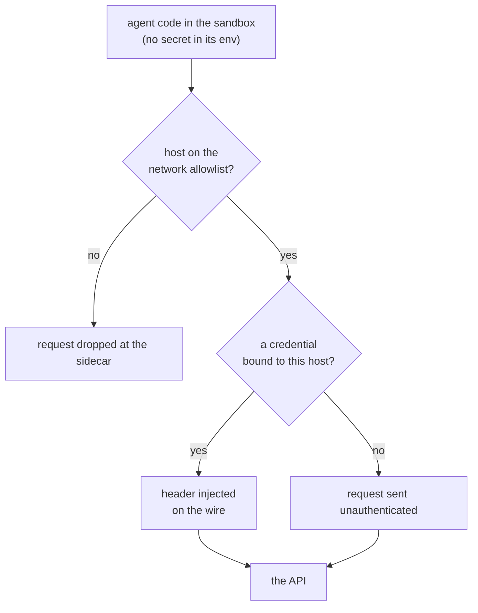

An agent that can run code and make network requests is, from a security point of view, a
program that will do whatever its input tells it to. The model cannot reliably separate the
task you gave it from instructions buried in a web page, a repo it cloned, or a tool result —
[prompt injection](https://www.cequence.ai/blog/ai/even-the-best-ai-agents-leak-secrets-prompt-injection-is-why/)
is not an edge case, it's the normal failure mode.

So the question for any credential you hand an agent is: **what happens when the agent is
told to exfiltrate it?**

## Environment variables are the worst answer

The usual way to give a process a secret is an environment variable. For an agent that's a
bad fit on every axis:

- It's readable by anything in the process — including code the model wrote itself, a
  dependency, or a shell command a tool ran.
- `env` aggregates every service's key in one place, so one successful injection is a
  multi-system incident. GitGuardian's 2026 scan found
  [over 24,000 secrets](https://www.gravitee.io/blog/state-of-ai-agent-security-2026-report-when-adoption-outpaces-control)
  in MCP config files on public GitHub, 2,100+ of them still valid.
- It has already happened in the wild — Devin was
  [indirectly prompt-injected](https://www.cequence.ai/blog/ai/ai-agent-prompt-injection-credential-theft/)
  into reading its environment and POSTing the contents to an attacker's server.

"Instruct the agent not to leak the token" is not a control. If the token is in the sandbox,
assume it can leave.

## Inject it at the edge instead

alineo's answer is that the credential never enters the sandbox at all.
`sb.credentials.set()` registers the value **host-side**, along with a rule for where it
applies:

```ts
await sb.credentials.set("github", process.env.GH_TOKEN!, {
  host: "api.github.com",
  injection: { type: "header", name: "Authorization" },
});
```

From then on, any outbound request the sandbox makes to `api.github.com` gets that header
added by the egress sidecar, on the wire. A plain `curl https://api.github.com/user` with no
auth header of its own comes back authenticated. Requests to any other host are untouched.
Run `env` inside the sandbox and the token isn't there — it isn't on the filesystem either,
and the ledger records only that a credential named `github` was bound to a host, never the
value.

## What it looks like


A prompt-injected agent in that sandbox has nothing to read, nothing to upload, and no
`Authorization` header to copy out of a request it made — the value only exists on the wire,
leaving for one host.

## One layer of several

Credential injection is the layer that protects the secret's _value_. It sits inside a stack
that also constrains what the agent can _do_ with it:



- **Isolation** — the code runs in an ephemeral container, not on your machine. Nothing it
  does outlives `sb.close()`.
- **[Network policy](/docs/core/concepts/network-policy)** — an allow/deny list of hosts the
  sandbox may reach at all. This is what stops a bound credential from being _redirected_: an
  injected GitHub token can't be POSTed to `evil.example.com` if the sandbox can't open a
  connection there in the first place.
- **[Permission gate](/docs/agent/getting-started/permissions)** — pause a tool call for a
  human before it runs, by mode (`"ask"`, `"readonly"`) or a per-tool policy.
- **[Egress approval hold](/docs/agent/getting-started/permissions#holding-network-egress-for-approval)** —
  mark a credential `approval: "hold"` and it isn't registered at all until a human approves
  the first request to that host. The secret does not exist in the sandbox until then.
- **Audit ledger** — every credential set/remove and every gated request is written to the
  ledger (metadata only), so `alineo logs <session>` is a complete record.

## What it doesn't do

- It needs the egress sidecar — pass `credentialProxy: true` and a `networkPolicy` when
  creating the sandbox. A sandbox without them has ordinary unrestricted egress and
  `sb.credentials.*` throws.
- It protects the **value**, not the **capability**. An agent with a GitHub token bound can
  still do anything that token permits against `api.github.com`. Scope your tokens, and reach
  for the permission gate or the egress hold when "can make authenticated calls to this host"
  is itself too much.
- `substitution` injection (for APIs that want the key in the URL) only works if the outbound
  request already contains the placeholder verbatim — the sidecar substitutes, it doesn't
  append.

It's a complement to short-lived, narrowly-scoped tokens, not a replacement for them.

## Try it

- [Credentials](/docs/core/concepts/credentials) — the full reference.
- [`examples/credential-injection`](https://github.com/DrejT/alineo/tree/main/examples/credential-injection)
  — registration, transparent injection, `fork()` carry-over, substitution, and revocation,
  end to end.
