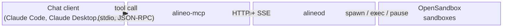

[alineod](/docs/alineod) already runs swarms of sandboxed agents over HTTP and SSE — fork a
reviewer per concern, pause one mid-turn, steer another, gather the results. That's a natural fit
for an SDK, but every AI chat client speaks a different protocol for calling tools: MCP. There was
no way to point Claude Code, Claude Desktop, or Cursor at alineod and just ask it to run a swarm
for you.

`alineo-mcp` is that bridge — a stdio MCP server that puts alineod's whole swarm-control surface
behind tool calls any MCP client already knows how to make.

## Connect it

Drop it into your client's `mcpServers` config and point it at a running alineod:

```json
{
  "mcpServers": {
    "alineo": {
      "command": "npx",
      "args": ["-y", "alineo-mcp"],
      "env": { "ALINEOD_URL": "http://127.0.0.1:4600" }
    }
  }
}
```

No alineod yet? `alineo-mcp` ships a bootstrap tool for that too — more on it below.

## The tools

| Tool                                             | Route                           |                                                         |
| ------------------------------------------------ | ------------------------------- | ------------------------------------------------------- |
| `alineod_create_run`                             | `POST /runs`                    | Load the root agent from an AgentSpec, start a run      |
| `alineod_get_run`                                | `GET /runs/:runId`              | The spawn tree — every agent, state, parent pointers    |
| `alineod_delete_run`                             | `DELETE /runs/:runId`           | Abort + close every live agent in the run               |
| `alineod_watch_events`                           | `GET /runs/:runId/events` (SSE) | Collect lifecycle + harness events for a bounded window |
| `alineod_spawn_agent`                            | `POST /runs/:runId/agents`      | Fork a child under a live parent                        |
| `alineod_get_agent`                              | `GET /agents/:agentId`          | Inspect an agent + session stats                        |
| `alineod_prompt_agent`                           | `POST /agents/:agentId/prompt`  | Drive one turn                                          |
| `alineod_steer_agent`                            | `POST /agents/:agentId/steer`   | Redirect the current turn                               |
| `alineod_pause_agent`                            | `POST /agents/:agentId/pause`   | Freeze the sandbox container                            |
| `alineod_resume_agent`                           | `POST /agents/:agentId/resume`  | Thaw a paused container                                 |
| `alineod_stop_agent`                             | `POST /agents/:agentId/stop`    | Abort + close one agent                                 |
| `alineod_get_result`                             | `GET /agents/:agentId/result`   | Resolve a settled agent's output                        |
| `alineo_init`                                    | —                               | Start OpenSandbox + alineod locally via Docker          |
| `alineo_add_spec` / `list_specs` / `remove_spec` | —                               | Manage the local saved-agent-spec cache                 |

Every alineod route is here — a chat client that can call tools can do anything a script using
alineod's raw HTTP API can.

## The demo

The same swarm from [Swarm Code Review](/docs/cookbooks/swarm-code-review) — a lead checks out a
repo once, two reviewers fork from its sandbox, one gets paused and resumed mid-turn, the other
gets steered onto a narrower brief, an editor waits for both and merges their findings — run again
here, but every step is now an `alineo-mcp` tool call instead of a raw HTTP request:


Every line above is copied verbatim from a real run against a live `alineod`. The pacing is sped up for
watchability — the actual run took about 15 minutes, mostly spent waiting on NVIDIA's free-tier model
latency across four agents.

Full recipe, side by side with its raw-HTTP twin, at
[`cookbooks/mcp-agent-swarm`](/docs/cookbooks/mcp-agent-swarm).

## How it works



`alineo-mcp` is a thin translation layer, not a second control plane. `src/alineod-client.ts` is
an HTTP client typed against alineod's documented wire contract — the same one any external
caller uses — and each tool handler just forwards a call and shapes the response. It doesn't hold
its own state: alineod's run tree is still the source of truth.

One thing worth knowing if you script against it directly, the way the cookbook does: an MCP tool
call is request/response, so a call that maps to a long-poll on alineod's side —
`alineod_get_result`'s `waitSeconds`, `alineod_watch_events`'s `maxWaitSeconds`, a
`waitFor`-carrying `alineod_spawn_agent` — needs to outlast the _client's_ own request timeout,
not just the one you pass the tool. A chat client's default is usually generous enough not to
notice; a script you write yourself should set it explicitly for those calls.

## How it fits

Nothing about the swarm changes. Every agent `alineo-mcp` spawns is the same `AgentSpec` you'd
hand `alineod` directly — the same permission gate, the same credential injection, the same
`alineo init` bootstrap. `alineo-mcp` doesn't introduce a second way to describe an agent; it's a
second way to _drive_ the one you already have.

That includes the bootstrap tool. `alineo_init` starts OpenSandbox and alineod locally via
Docker, same as `alineo init` on the CLI — including a networking fix that came out of building
this: alineod normally binds Docker's host network directly so it sees `127.0.0.1` the same way
the host does, but Docker Desktop for Windows and Mac doesn't support that the way native Linux
does, so alineod would come up "running" and be silently unreachable. Both `alineo init` and
`alineo_init` now detect that and fall back to bridge networking automatically — one fix, both
entry points, since they share the same bootstrap code underneath.

## What it doesn't do

Stdio only, for now — `alineo-mcp` is a local subprocess your client launches, not a hosted
service you point multiple clients at. It needs a reachable alineod (or Docker, if you use
`alineo_init` to start one), same as any alineod client. And it isn't on npm yet — build it from
source (`bun run --cwd packages/mcp build`) until the next release publishes it.

## Try it

[`cookbooks/mcp-agent-swarm`](/docs/cookbooks/mcp-agent-swarm) is the full recipe above, runnable
end to end. [`packages/mcp`](https://github.com/DrejT/alineo/tree/main/packages/mcp) has the
source, the full client-config table for Claude Code, Claude Desktop, and Cursor, and every tool's
exact shape.
