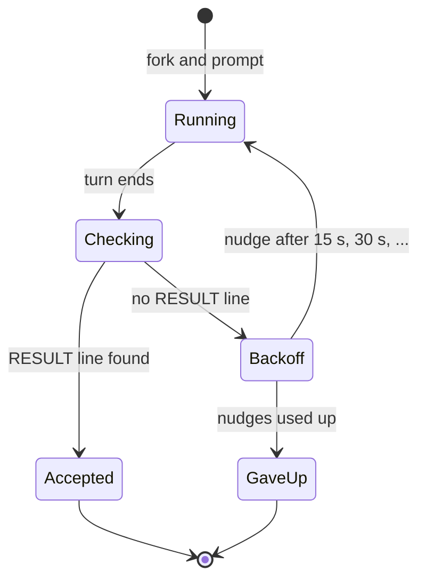

To run an autoresearch-style loop with several agents, give each one its own sandbox and the same
task: one file to edit, one metric to lower, and a judge it can't edit. Start them together, and
**supervise them yourself**, because an agent's turn ending isn't the same as it finishing. In three
runs on one model API, the best agent took a held-out score from 3.03 to 2.52 bits per character.
In each run at most one of four agents delivered a valid result. The rest were cut off by overload
and rate-limit errors.

```bash
# a lead sandbox holds the task; four researchers fork from it and run in parallel
ALINEOD_URL=http://localhost:4600 bun examples/alineod-autoresearch/index.ts
```

## What is autoresearch, and what did we copy?

[Karpathy's autoresearch](https://github.com/karpathy/autoresearch) gives one agent a single file
to edit (`train.py`), a fixed judge it can't touch (`prepare.py`), and instructions from a human
(`program.md`). The metric is `val_bpb`, validation bits per byte, where lower is better. Each
experiment gets exactly five minutes, about 12 an hour, on one NVIDIA GPU.

[SkyPilot](https://skypilot.ai/blog/scaling-autoresearch/) then gave an agent 16 GPUs. It ran about
910 experiments in 8 hours and took `val_bpb` from 1.003 to 0.974. It reached the same best loss
9x faster than a simulated one-GPU run, and it tried grids of settings in a single wave instead of
one setting at a time.

We kept the shape and swapped the GPU for something a CPU does in under a second:

|                    | Karpathy's autoresearch | This example                                   |
| ------------------ | ----------------------- | ---------------------------------------------- |
| The agent edits    | `train.py`              | `model.py`, a character-level language model   |
| Fixed judge        | `prepare.py`            | `evaluate.py`                                  |
| Human instructions | `program.md`            | `program.md`                                   |
| Metric             | `val_bpb`               | `val_bpc`, bits per character on held-out text |
| One experiment     | 5 minutes on a GPU      | under a second on a CPU                        |

This is a toy. It shows how to orchestrate the agents, not how to do GPU research.

## How is the task set up?

The model trains on the first 80% of a public-domain novel and is scored on the last 20%. The
baseline (add-one smoothing on two characters of context) scores **3.0283**. A reference solution I
wrote by hand, an interpolated n-gram, scores 2.37, so there is real room to improve.

The judge refuses a model whose probabilities don't sum to 1 and one that takes longer than 30
seconds. I checked that `p = 1` for everything and a slow model are both rejected. One hole
remains: an agent with file access could read the held-out text. `program.md` forbids it, and a
real setup should keep evaluation somewhere the agent can't read.

## How do I run the agents in parallel?

Put the task files in a lead agent's sandbox with `setup` steps, then fork one researcher per
starting direction. Every fork inherits `/work`, and each researcher edits its own copy.

```bash
curl -s -X POST $ALINEOD/runs/$RUN/agents -H 'content-type: application/json' -d '{
  "spec": { "name": "researcher-1", "cli": "pi", "provider": "nvidia",
            "model": "nvidia/nemotron-3-super-120b-a12b",
            "env": { "NVIDIA_API_KEY": "${NVIDIA_API_KEY}" },
            "resources": { "cpu": "500m", "memory": "1Gi" } },
  "parentAgentId": "'$LEAD'",
  "prompt": "Read /work/program.md and follow it exactly. Your starting direction: smoothing."
}'
```

The key stays a literal `${NVIDIA_API_KEY}` in the request. alineod resolves it from its own
environment. The four fork requests came back within a second, and one vCPU carried all four agents, because
the model calls happen elsewhere.

## What happened on a real run?


The recording replays the output of the third run. Three runs on the same model
(`nemotron-3-super-120b-a12b`), each with four researchers. "Valid" means the agent's last message
had the `RESULT` line the instructions ask for. "Verified" means I re-ran `evaluate.py` in its
sandbox afterwards, so the score doesn't depend on what the agent said.

| Run | What the orchestrator did                             | Valid results | Best verified score             |
| --- | ----------------------------------------------------- | ------------- | ------------------------------- |
| 1   | Waited for each turn to end and checked the result    | 0 of 4        | 2.7759 (unfinished)             |
| 2   | Also nudged an agent that ended without a result      | 1 of 4        | **2.5173** (it reported 2.5212) |
| 3   | Nudged with a growing pause, 15 s then 30 s and so on | 1 of 4        | 2.7759 (it reported the same)   |

Every agent I could inspect did real work: between 15 and 40 tool calls each, mostly running the
judge and editing `model.py`. Two agents in run 3 were stopped before I could check their
sandboxes, so the last column covers the sandboxes I could verify. Baseline is 3.0283, so lower is
better.

## Why did three of four agents not finish?

Pi, the coding agent inside each sandbox, keeps a session log. In it, the last assistant message
of a cut-off turn has `stopReason: "error"`, with `Service temporarily overloaded` or
`429 status code (no body)` as the message. A single agent's log held between 1 and 17 of these.
The model API was refusing requests, and four agents on one key were too many for it.

alineod recorded what it was told. Some of those turns ended `success` with an empty result, and
others ended `failed`. Either way, **the outcome alone doesn't say whether the agent finished**,
and a `waitFor` quorum counts agents whose turn ended. In an earlier test with a different model, a
quorum picked two agents that had only run the baseline.

## How do I supervise agents when the model API is flaky?

Give each researcher its own loop. Wait for its turn to end, check the result yourself, and if it
isn't a real one, wait a little and tell the agent to carry on. Stop everyone else once enough
results are valid.



The pause matters. In run 2 there was none, and an overloaded API fails again instantly, so three
agents used up all four nudges in roughly a minute. Simplified from the example:

```ts
for (let nudge = 0; ; nudge++) {
  await turnEnds(id); // poll GET /agents/:id until it's done or failed
  const { result } = await api("GET", `/agents/${id}/result`);
  if (RESULT_LINE.test(result)) return accept(id, result);
  if (nudge === MAX_NUDGES) return giveUp(id);
  await Bun.sleep(15_000 * (nudge + 1)); // an overloaded API fails again at once
  await api("POST", `/agents/${id}/prompt`, { text: NUDGE });
}
```

## Which model should I use?

The model API decided this more than anything else. On 2026-09-20, on our account, running the
loop directly against the API (no agent runtime, single runs, so treat the gaps as rough):

| Model                            | Verified score        | Notes                                                                                                      |
| -------------------------------- | --------------------- | ---------------------------------------------------------------------------------------------------------- |
| `nemotron-3-super-120b-a12b`     | 2.77 and 2.51         | Fastest. The first judge run came within 10 seconds.                                                       |
| `nemotron-3-ultra-550b-a55b`     | 2.78                  | Slow, with a first judge run after two to three minutes. A second run ended with a file the judge rejects. |
| `gpt-oss-20b`                    | no gain in three runs | Server-side errors as well.                                                                                |
| `nemotron-3.5-lightning-30b-a3b` | none                  | About 100 seconds per request.                                                                             |

Several models the API lists returned a 404 for our account, and others timed out at 100 seconds
on a one-word reply. Check yours with a trivial request and one tool call before you choose.

## What can't this setup do?

- **GPU research.** The task is a CPU toy, and the numbers don't compare to autoresearch's.
- **Trust the agents' scores.** They report their own. I verified them by re-running the judge, and
  the example doesn't do that for you.
- **Stop an agent from reading the held-out text.** Only the instructions forbid it.
- **Cap spend.** Nudging costs tokens. `MAX_NUDGES` and `DEADLINE_MIN` bound it.
- **Say much about run-to-run variance.** Three runs, and a model API that changes minute to
  minute.

## Frequently asked questions

### Can I run Karpathy's autoresearch itself this way?

Not as it stands. It needs a GPU. A sandbox's `resources` accept a `gpu` value, but we haven't run
GPU training in one, so we can't say how it behaves.

### How many agents should I run in parallel?

Four was too many for one API key on the day: every run hit overload or 429 errors, and we haven't
measured where the limit is. The host wasn't the limit, since one vCPU carried them. Start with
fewer, and read Pi's session log for `stopReason: "error"`.

### Where do the scores come from?

The table shows both. An agent's score is what it printed in its last message. A verified score is
the judge re-run on its final files. Two agents reported a score: one matched exactly, and the
other reported 2.5212 against a verified 2.5173.

## Try it

- Example:
  [`alineod-autoresearch`](https://github.com/DrejT/alineo/tree/main/examples/alineod-autoresearch),
  with the task, the judge and the orchestrator.
- Guides: [Coordination](/docs/alineod/guides/coordination) and
  [Steering and pausing](/docs/alineod/guides/steering-and-pausing).
