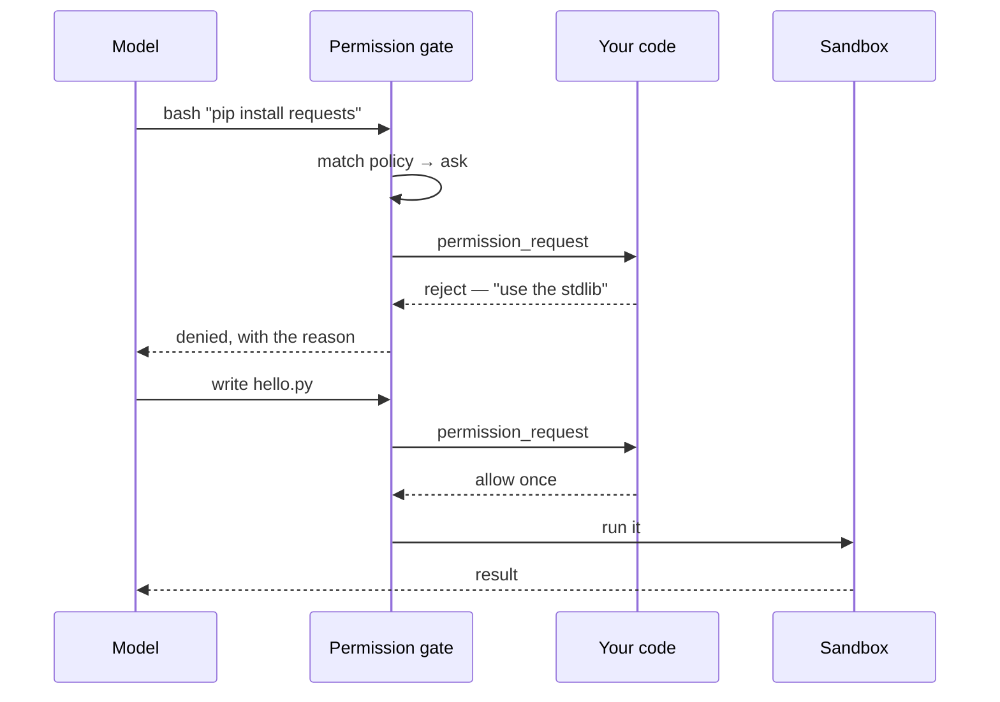

A sandboxed Pi agent runs its tools without asking — that is the point of a sandbox. But
"without asking" is the wrong default for some calls: installing a package, writing to a
path that matters, anything that reaches the network. You want most of the run to be
autonomous and a few moments to pause for a person.

`AgentSpec.permissions` is that pause.

## One field

The quickest form is a string:

```json
{ "name": "my-agent", "cli": "pi", "permissions": "readonly" }
```

`"readonly"` restricts the model's toolset to the read-only tools (`read`, `grep`, `find`,
`ls`) — it never even sees `write` or `bash`. `"ask"` pauses before every call. `"auto"` (the
default) keeps today's behavior: no gate is loaded at all.

For anything in between, `permissions` takes a policy — ordered rules, last match wins:

```jsonc
{
  "permissions": {
    "default": "ask",
    "rules": [
      { "tool": "read", "action": "allow" },
      { "tool": "ls", "action": "allow" },
      { "tool": "bash", "action": "classify" },          // read-only bash runs free
      { "tool": "bash", "pattern": "*rm -rf*", "action": "deny" }  // never, no prompt
    ]
  }
}
```

`classify` is a conservative read-vs-write triage of a shell command: it splits on `&&` /
`||` / `;` / `|` and allows the call only if every part is a recognised pure reader (`ls`,
`cat`, `git status`, …). Anything else falls through to `ask`.

## What it looks like

Here is that policy resolving the six calls from the
[`human-in-the-loop`](https://github.com/DrejT/alineo/tree/main/examples/human-in-the-loop)
example — reads run untouched, writes pause for the operator, `rm -rf` is refused outright:


## How it works

Enforcement is a bundled Pi extension on the `tool_call` hook. When a rule resolves to
`ask`, the extension holds the call and the SDK emits a `permission_request` on the agent
stream; your code answers it and the held call resumes or fails.



Answer requests inline, or hand `prompt()` an `onPermission` handler and skip the loop:

```ts
async function onPermission(req: PermissionRequest): Promise<PermissionDecision> {
  if (/\b(pip|npm|apt)\b.*\binstall\b/.test(req.target)) {
    return { kind: "reject", feedback: "No installs in this run — use the standard library." };
  }
  return { kind: "once" };
}

for await (const ev of agent.prompt("Do the task", { onPermission })) {
  if (ev.type === "text") process.stdout.write(ev.text);
}
```

Every request and resolution is written to the ledger — metadata only, never raw tool
arguments — so `alineo logs <session>` is a full record of what was gated and how it was
decided.

## What it doesn't do

The gate runs **inside** the Pi process. It stops a misbehaving *model* — it is not a barrier
against a process with a shell inside the sandbox actively working around it. To gate a host
regardless of what runs inside, hold the network itself: mark a credential binding with
`approval: "hold"` and the secret does not exist in the sandbox until someone approves the
first request to that host.

Fully durable pauses across `sb.pause()` / checkpoint need an upstream Pi change and are a
tracked follow-up.

## Try it

- [Permission gate](/docs/agent/getting-started/permissions) — the full reference.
- [`examples/human-in-the-loop`](https://github.com/DrejT/alineo/tree/main/examples/human-in-the-loop)
  — a scripted, unattended end-to-end walkthrough.
