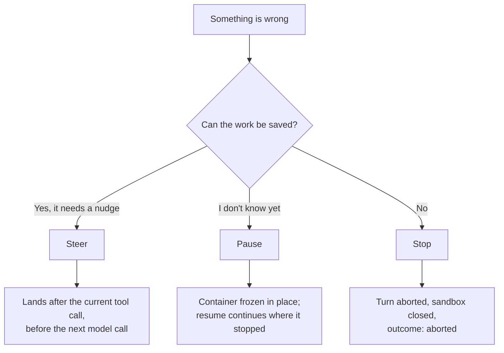

To stop a runaway swarm of AI agents, act on the agents from **outside** them. Pause freezes a
whole branch, steer redirects a parent before its next model call, and stop aborts the turns and
closes the sandboxes, leaves first. In [alineod](/docs/alineod), each of the three takes
`"scope": "subtree"`, and each answers with one result per agent, so you can see what actually
happened.

```bash
# freeze an agent and everything it started
curl -s -X POST $ALINEOD/agents/a_08b5d666/pause \
  -H 'content-type: application/json' -d '{"scope": "subtree"}'
```

## Why can't the agent stop itself?

A looping agent is still running its loop. A "please stop" message lands in the same context
that's misbehaving. A timeout written into the agent's own code never fires if the agent is
blocked inside a tool call, and a `while true` in a bash tool never hands control back.

So the kill switch has to live in something the agent can't reach. Every agent in a swarm runs in
its own OpenSandbox container, and alineod, the daemon that started it, holds a handle to that
container. It can freeze or close the container without asking the agent.

## Which control should I use?



| Control        | What it does to a running tool call                                                               | Reversible?                                 | Route                                               |
| -------------- | ------------------------------------------------------------------------------------------------- | ------------------------------------------- | --------------------------------------------------- |
| Steer          | Nothing. It waits for the call to finish, then delivers the message before the model's next call. | It's a message, so there's nothing to undo. | `POST /agents/:id/steer`                            |
| Pause          | Freezes it mid-run. It carries on from exactly where it stopped after resume.                     | Yes                                         | `POST /agents/:id/pause`, `POST /agents/:id/resume` |
| Stop           | Aborts the turn and closes the sandbox.                                                           | No                                          | `POST /agents/:id/stop`                             |
| Delete the run | Stops every live agent in the run. The ledger is kept.                                            | No                                          | `DELETE /runs/:runId`                               |

The first row matters for runaway loops. Steering an agent that's stuck inside a tool call that
never returns does nothing until the call ends. To cut it off, stop it.

## How do I pause a whole swarm without losing its work?

Send `pause` to the agent at the top of the branch with `"scope": "subtree"`. alineod resolves
everything under it, parents first so a parent stops spawning before its children freeze, and
returns a result for every member.

In the run below, a lead agent is waiting on two workers that are each stuck in
`while true; do echo tick; sleep 3; done`. A second, unrelated run is working on its own task.
The pause took 0.18 seconds:

```text
{"agentId":"a_08b5d666","outcome":"applied"}
{"agentId":"a_0c930f20","outcome":"applied"}
{"agentId":"a_415388ca","outcome":"applied"}
```

`docker inspect` agrees that the three containers are frozen and the other run's is not (trimmed
to the four agent sandboxes):

```text
/sandbox-1ca5d5f paused=true
/sandbox-26162fc paused=true
/sandbox-a7cf899 paused=true
/sandbox-d51a183 paused=false
```

Each frozen agent records who paused it in `pausedBy`: `operator` for the one you named, `cascade`
for everything below it. Resume goes the other way, children first and the named agent last. It
took 0.31 seconds here.

A pause is best effort per member. One agent failing doesn't undo or block the rest, and its
`failed` result carries the reason. A child that hasn't forked yet joins the pause the moment it
does.

## How do I stop one runaway branch and keep everything else running?

Stop the top of the branch with the same scope. It goes leaves first, so no parent is closed under
a child that's still using it.


The recording replays the captured output of that run; the durations in it are the ones the
daemon measured. Stopping the subtree took 2.76 seconds, which includes closing three sandboxes.
Afterwards:

```text
$ curl -s $ALINEOD/runs/r_3c1868f3 | jq -c '.agents[] | {agentId, state, outcome}'
{"agentId":"a_08b5d666","state":"aborted","outcome":"aborted"}
{"agentId":"a_0c930f20","state":"aborted","outcome":"aborted"}
{"agentId":"a_415388ca","state":"aborted","outcome":"aborted"}
$ curl -s $ALINEOD/runs/r_94da5f40 | jq -c '.agents[] | {agentId, state, outcome}'
{"agentId":"a_d0b59f47","state":"running","outcome":null}
```

The branch is gone and the other run is still going. An agent that had already finished keeps its
outcome when you stop it: its sandbox is released and the recorded `success` stays.

## How do I redirect a swarm instead of stopping it?

Steer the parent with `"scope": "subtree"`. It gets one message: your text, a table of its
children with their state and what each was asked to do, and an instruction to re-plan. It
decides what each child does next. The children receive nothing directly, because the same words
rarely fit a parent and its workers.

The response says how the message arrived. `steer` means it went into the running turn, `turn`
means the parent was idle and it started a new one, and `queued` means the parent was paused and
will get it on resume.

## What keeps a swarm from running away in the first place?

- **Spawn budgets.** `spawnDepth` limits how many levels of children an agent may create, and
  `maxAgents` caps descendants. Both are tracked per lineage. A spawn over budget ends with the
  outcome `budget-exceeded` and a `budget_denied` event.
- **A time limit on quiet turns.** If a turn's stream goes quiet, alineod follows it by polling.
  One still running after 30 minutes of unpaused time (the default, set by
  `ALINEOD_TURN_MAX_MS`) is ended, and any text it had produced becomes the result.

That's the full list. There's no token or spend cap and no automatic loop detection. If cost is
what you're guarding against, the budgets bound how many agents exist, not how much any one of
them spends.

## What can't these controls do?

- **Children a parent forks itself.** A parent can fork children by running the `alineo` CLI
  inside its own sandbox. Those calls go to OpenSandbox directly, so alineod doesn't see them.
  Subtree pause, stop and steer won't reach those children. Routing the CLI through alineod is
  planned.
- **Interrupt a running tool call with steer.** Only stop does that.
- **Drain.** `mode: "drain"` on stop currently behaves like `abort`.
- **Freeze everywhere.** On Docker-backed OpenSandbox, pause is a true in-place freeze. On
  Kubernetes it's snapshot-based, and in-memory state doesn't survive.

## Frequently asked questions

### Does pausing an agent lose its state?

On Docker, no. The harness process and any tool it's running are suspended, and resume continues
from exactly there. The turn's stream goes quiet while paused but doesn't error, and paused time
doesn't count toward that limit.

### Can I still stop a swarm after alineod restarts?

Yes. On boot, alineod reconnects to each live agent's sandbox. A paused agent stays paused and
resumes normally. See [Crash recovery](/docs/alineod/concepts/crash-recovery).

### Do my agents need to change?

No. Every agent in the swarm is still an ordinary `AgentSpec`, so the permission gate and
credential injection you already use apply unchanged, and `alineo init` is the same setup.

## Try it

- Guide: [Steering and pausing](/docs/agent/concepts/steering), and
  [Coordination](/docs/alineod/concepts/coordination) for waiting on groups of agents.
- Example:
  [`alineod-coordination`](https://github.com/DrejT/alineo/tree/main/examples/alineod-coordination)
  pauses, steers and stops a subtree end to end.
