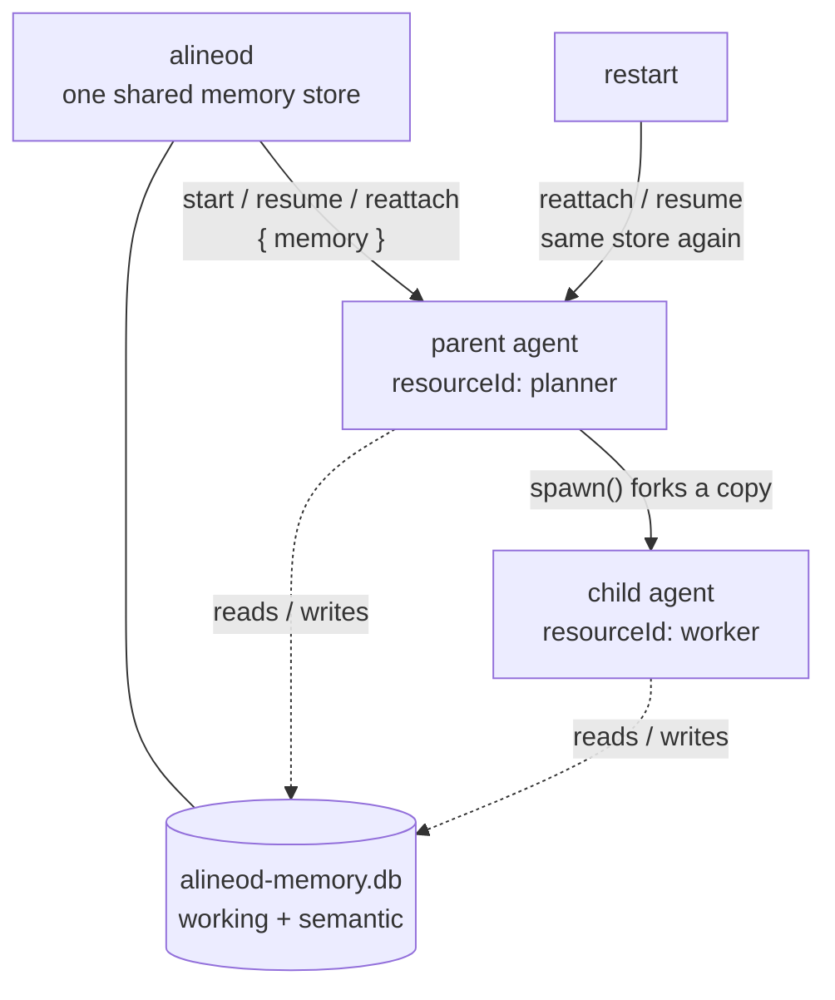

An agent's sandbox is disposable; what it learned shouldn't be. alineod gives every agent it drives a durable
`@alineo-labs/memory` store, scoped by **who the agent is** rather than which sandbox it happens to run in.




## What is stored, and under what key

Memory is keyed by a **resource ref**: the spec's `resourceId` (default: its `name`) plus the optional `teamId`.
That is the same rule `Alineo.resourceRef` uses, so it holds inside and outside alineod.

- Two agents with the same `resourceId` share memory. A different `teamId` does not.
- Memory outlives the sandbox. A lost container, a restore from checkpoint onto a different sandbox, a finished
  or stopped agent, and an alineod restart all leave it readable.
- **Working memory** is key/value: any JSON up to 64 KiB per value, keys up to 256 characters.
- **Semantic memory** is a set of facts recalled by meaning. It needs an embeddings endpoint (below); without one
  the facts routes answer `501` and working memory still works.

## Spawned children

`Alineo.spawn()` copies the parent's `.memory` onto the child and forks the parent's scope into the child's: the
child starts with a **copy**, then diverges. Mutating the child's memory never touches the parent's. This holds
after a restart too, because a rehydrated parent is handed the store again.

Copying semantic facts re-embeds them in one batched call, so a fork of a large memory costs one embeddings
request, not one per fact.

## Example

```bash
# Give the root agent some working memory (agent a_1 has resourceId "planner")
curl -X PUT localhost:4600/agents/a_1/memory/goal   -H 'content-type: application/json' -d '{"value": {"ship": "v2"}}'

# Spawn a child from it. It starts with a copy:
curl localhost:4600/agents/a_2/memory
# {"agentId":"a_2","resourceRef":{"resourceId":"worker"},"semantic":false,
#  "working":{"goal":{"ship":"v2"}}}

# With an embeddings endpoint configured: remember, then recall by meaning
curl -X POST localhost:4600/agents/a_1/facts   -H 'content-type: application/json' -d '{"content": "the customer prefers email"}'
curl 'localhost:4600/agents/a_1/facts?query=how%20to%20contact%20them&topK=3'
```

## Configuration

| Variable                               | Default                    | Description                                                                                             |
| -------------------------------------- | -------------------------- | ------------------------------------------------------------------------------------------------------- |
| `ALINEOD_MEMORY_ENABLED`               | `true`                     | `false` runs agents with no memory and answers the memory routes `501`.                                 |
| `ALINEOD_MEMORY_DB_PATH`               | `./data/alineod-memory.db` | One SQLite file for working and semantic memory. Separate from the ledger: different retention.        |
| `ALINEOD_MEMORY_EMBEDDINGS_URL`        | _(empty)_                  | Full URL of an OpenAI-compatible `/v1/embeddings` endpoint. With the model, turns semantic memory on.   |
| `ALINEOD_MEMORY_EMBEDDINGS_MODEL`      | _(empty)_                  | Model name sent to it. Required with the URL; setting only one is a startup error.                      |
| `ALINEOD_MEMORY_EMBEDDINGS_API_KEY`    | _(empty)_                  | Bearer token. Empty sends no `Authorization` header.                                                    |
| `ALINEOD_MEMORY_EMBEDDINGS_ASYMMETRIC` | `false`                    | Send `input_type` `passage` when storing and `query` when recalling, for retrieval models that need it. |
| `ALINEOD_MEMORY_EMBEDDINGS_TIMEOUT_MS` | `30000`                    | Bound on one embeddings request, body included.                                                         |
| `ALINEOD_MEMORY_MAX_FACTS`             | `0`                        | Keep at most this many facts per resource, dropping the oldest as new ones arrive. `0` = unbounded.     |
| `ALINEOD_MEMORY_MAX_AGE_MS`            | `0`                        | Drop facts older than this on each pass. `0` = facts never expire.                                      |

The store opens at boot, before agents are reconnected, so a bad path stops alineod with a clear error instead of
failing the first spawn.

<Callout type="warn" title="Changing the embeddings model">
  Don't change the embeddings **model** on a store that already holds facts. Vectors from different models aren't
  comparable, so recall quietly degrades — and a model of a different dimension is refused outright, with an error
  that says so, before anything is written. Point `ALINEOD_MEMORY_DB_PATH` at a fresh file when you switch.
</Callout>

## HTTP API

Routes take an **agent id** but resolve the scope from the agent's persisted spec, so they work for agents that
have ended, or that alineod hasn't reconnected yet.

| Method   | Path                           | Description                                                                |
| -------- | ------------------------------ | -------------------------------------------------------------------------- |
| `GET`    | `/agents/:agentId/memory`      | One page of working memory in ascending UTF-8 key order (`?limit=`, default 100, max 1000; `?after=` a key), the resource ref, and whether facts are on. A `nextAfter` in the reply means more keys follow — pass it back as `?after=`. |
| `GET`    | `/agents/:agentId/memory/:key` | One value. `404` if the key isn't set.                                     |
| `PUT`    | `/agents/:agentId/memory/:key` | Set a value. Body `{ "value": <any JSON> }`.                               |
| `DELETE` | `/agents/:agentId/memory/:key` | Remove a key. Idempotent, always `204`.                                    |
| `POST`   | `/agents/:agentId/facts`       | Remember a fact. Body `{ "content", "sourceRef"? }`. `201`.                |
| `GET`    | `/agents/:agentId/facts`       | `?query=` recalls by meaning (`?topK=`, default 5, max 100). Without it, lists the newest facts first (`?limit=`, default 100, max 1000) from an index, so cost follows the page size, not how many facts are stored. |
| `POST`   | `/agents/:agentId/compactions` | Prune now. Body `{ "maxFacts"?, "maxAgeMs"? }`; age first, then the cap.   |

Large working memories are read key by key (`GET .../memory/:key`) or paged; one response never carries every entry.

`sourceRef` (`{ sandboxId, entryIndex }`) ties a fact to the ledger entry it came from. A fact with one is
`verified`; that flag is computed, never taken from the request.

| Status | When                                                                                |
| ------ | ----------------------------------------------------------------------------------- |
| `400`  | Invalid body or key, a value over 64 KiB, a bad `topK` or `limit`.                  |
| `404`  | No such agent (or, for `GET .../memory/:key`, no such key).                         |
| `501`  | Memory is disabled, or no embeddings endpoint is configured (for the facts routes). |
| `502`  | The embeddings provider failed or timed out. Nothing was stored.                    |
| `500`  | A local failure — typically SQLite (disk full, a locked or corrupt file). Never reported as `502`, so an operator is pointed at the right place. |

## Backups

`bun apps/alineod/scripts/backup.ts [destDir] [--keep N]` includes the memory database. Unlike both ledgers, it
can't be rebuilt from anything else: it is the only copy of what agents learned. The backup is taken with
`VACUUM INTO`, so it is consistent while alineod runs. To restore, stop alineod and put the file back at
`ALINEOD_MEMORY_DB_PATH`.

A backup is **all or nothing**. The copies are built in a hidden staging directory and moved into place only once
every database has copied and verified, so a failure never leaves a directory that looks like a backup but is
missing the database that mattered most. If the memory database holds a vector index and the `sqlite-vec`
extension can't load on the host, the backup stops before writing anything and says why. The three database paths
must have different file names, since each copy is written under its source's name.
